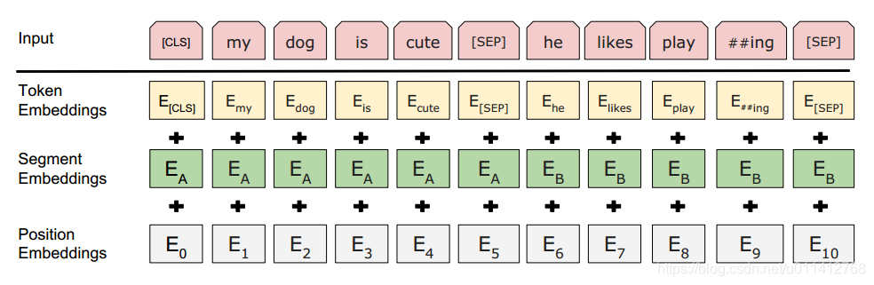

# 什么是预训练
通过自监督（无标注）来初始化神经网络模型参数

学习一种通用的语言理解能力

# BERT
## BERT的预训练任务
### Masked Language Modeling
将输入序列中的一部分（15%）token替换掉，然后去预测,让模型去预测这些词是什么。
#### 8-1-1
80%的词被设为`[MASK]`：完形填空，能联系上下文的双向语义

10%被替换为词表中的任意随机token：模型不知道哪些是随机的，可以提高模型的纠错能力。逼迫模型联系全局语境，根据语境生成预测的词向量。

10%保持原始token不变：把模型对词的表征拉向真实的表征
#### 优化目标
$$\mathcal{L}_{MLM} = - \sum_{i \in m} \log P(x_i | \tilde{X}; \theta)$$
输入的损坏序列为 $\tilde{X}$，被选中的掩码位置集合为 $m$，$\theta$ 为模型参数

模型预测出第 $i$ 个位置真实单词 $x_i$ 的概率 $P$ 越大，取对数后再加负号得到的损失值 $\mathcal{L}$ 就越小

也就是说：虽然模型在顶层其实会输出句子中每一个词的预测结果（包括那 85% 没有被选中的正常词），但系统在计算 Loss 时，只挑出那 15% 被选中（无论是变 [MASK]、变随机词还是保持原词）的位置进行计算。 剩下 85% 位置的输出会被直接无视，不参与打分。

### Next Sentence Prediction
随机抽取句子对（A，B），判断B是不是A的后续句子。增强跨句子理解的能力

50%真组合，50%假组合
#### [CLS] + A + [SEP] + B + [SEP]
`[CLS]`分类符，放在序列首位判断是不是next

`[SEP]`分隔符，分割两个句子

#### 优化目标
$$\mathcal{L}_{NSP} = - \left[ y \log \hat{y} + (1-y) \log (1-\hat{y}) \right]$$

## 特点
只使用了encoder，这提供了双向的理解能力
### 为什么不用decoder
bert的任务是理解任务，如果用decoder（masked attention），那就失去了上下文的理解能力。decoder是自左向右的，会把未来的词masked掉。
## 输入表示

Token：通过WordPiece进行切分

Segment：用于区分A和B句子。如果没有它，相隔很远的两个句子里的token是看不到`[SEP]`的

Postion：可学习位置编码

## 激活函数
GeLU
## 超参
base：12层encoder，768隐层维度，12头，110M
large：24层，1024隐层，16头，340M
## 优化目标
MLM和NSP联合损失
## 微调
分类：用`[CLS]`+全连接层做分类

序列标注：给每一个token都外接一个全连接层，用softmax给实体命名的每个类别打分

阅读理解/问答：去找答案的start和end。要把问题和文章同时喂给bert，问题是句子A，答案是句子B。用start vector和end vector与句子B里的每个token做dot product，然后softmax算概率