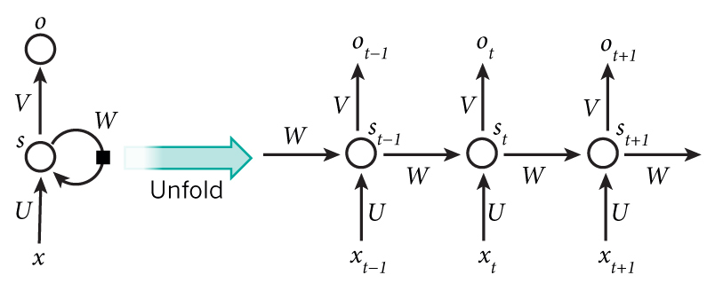
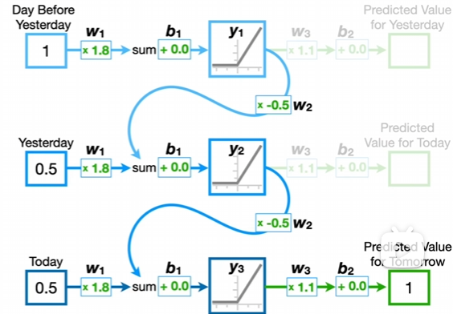

# 结构

纵向看，每一列相当于一个小的传统神经网络

x：输入层，长度为word embedding的维度

U：输入层到隐藏层的权重

s：隐藏层 = f(U * xt + W * s(t-1) + bias),即输入层的计算结果加上上一时刻的结果乘上一个权重W

V: 隐藏层到输出层的权重

o：输出 = softmax(V * st + bias)

# 注意
- 由公式可见，每个隐藏层s的值不仅依赖于当前时刻的输入，而且依赖于**上一个时刻的的结果s(t-1)**
- U,V,W都是共享的
- 不一定每一个时刻都要有一个输出，也就是说不是每一个小神经网络都必须有输出，它可以是不完整的
# 举例

这是一个时间序列做预测的例子，一共有三天的数据，预测明天的数据

w1 = U = 1.8， w2 = W = -0.5，w3 = V = 1.1

x0 = 1, x1 = 0.5, x2 = 0.5
这里的输入只是数字而不是向量
## Day0
s0 = f(1.8 * 1 + -0.5 * 0) = f(1.8) = 1.8
## Day1
s1 = f(1.8 * 0.5 + -0.5 * 1.8) = f(0) = 0
## Day2 (Prediction)
s2 = f(1.8 * 0.5 + -0.5 * 0) = f(0.9) = 0.9
o2 = g(1.1 * 0.9 + 0) = 0.99
## Day3 (Prediction)
o2即是对x3的估计，因为每一个神经网络的输出被视为对下一时刻的预测值

即x3 约等于 1

# 缺点

讨论梯度爆炸和梯度消失的时候，就是讨论Loss是如何反向传播的，讨论Loss的偏导

RNN会梯度爆炸和梯度消失的原因是它的权重矩阵W会循环相乘，而W是相同的，相同函数的多次组合会导致极端的非线性行为

## 梯度爆炸 
权重W是连乘的并且是同一个W，如果大于1，会导致偏导相当大（参数变化太大，错过最优点），出现梯度爆炸

## 梯度消失
如果W小于1，随着t的增大，偏导的值会有越来越趋于0，导致梯度消失，权重无法更新

## 长期依赖
节点经过许多阶段的计算后，之前比较长的时间片的特征会被覆盖