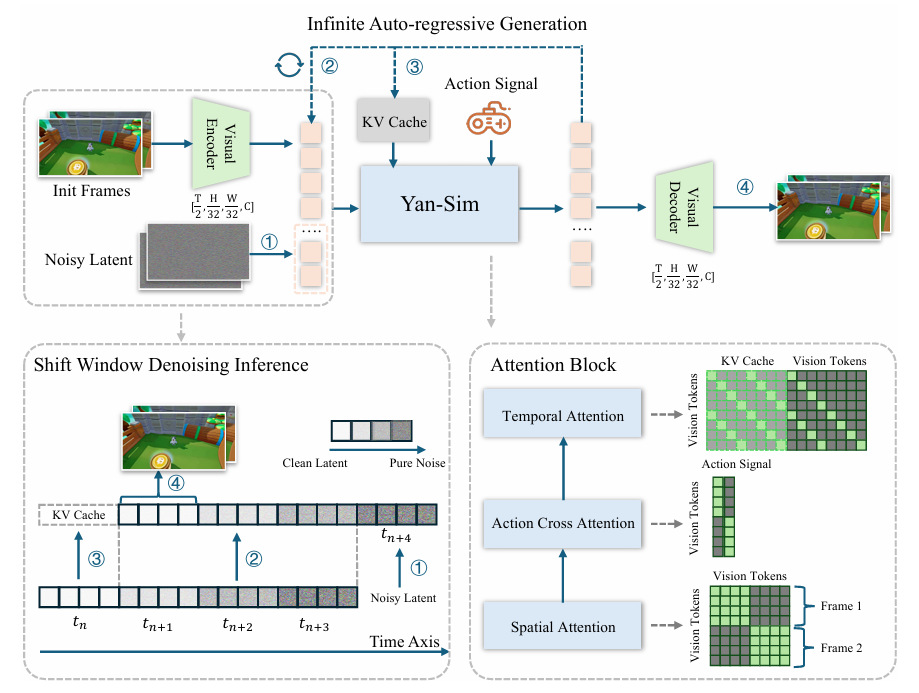

# Abstract

# Introduction

The first paragraph primarily discusses the applications and deficiencies of Interactive Generative Video (IGV). AIGC is evolving from generating text and images to video synthesis, and has now progressed to IGV. IGV requires dynamic reactions to user input, with applications ranging from virtual simulation to embodied intelligence. However, the deficiencies of current methods lie in the lack of high visual fidelity, sustained temporal coherence, and rich interactivity. Generated content also remains static after creation, failing to adapt in real-time. (Not high-definition, not coherent, not interactive).

The second paragraph details the shortcomings of existing methods. The video quality and generalization capabilities of GameNGen, PlayGen, and MineWorld are insufficient; The-Matrix, GameFactory, and Matrix-Game lack intricate physical simulation and have poor real-time performance. Most importantly, these methods treat interactive video as fixed content generation and do not support dynamic editing. Three core challenges are listed: **1. High-fidelity real-time visual experience**; **2. Highly generalizable, prompt-controllable generation**; **3. Dynamic, interactive editing during the interaction process and instant content customization.**
> 1. High-fidelity (high resolution, detailed realism, temporal coherence) imagery.
> 2. Real-time: Rapid generation under high frame rates (Latency must be minimal).
> 3. Good generalization capability.
> 4. On-the-fly: Modifying while the system is executing without stopping.
> 5. Capability for real-time editing, allowing style switching and interactivity.

> Traditional games generate the next frame through computation, e.g., physics engines calculate how many cm a character jumps under gravity; logic computations determine if one falls or hits a wall; rendering is done pixel-by-pixel via GPU.

The third paragraph describes the YAN architecture proposed in this paper. It is based on the Yuan_Meng_Star dataset and is primarily divided into three modules:

1. AAA-level Simulation: Utilizing high-compression, low-latency 3D-VAE combined with a KV-cache-based shift-window denoising inference process to achieve 1080p/60fps performance.
> 3D-VAE: Video compression package; compresses high-definition frames to make processing faster.
> KV-cache: Caches previously "processed" information, focusing only on the small window currently changing.

2. Multi-modal Generation: Hierarchical captioning, injecting game-specific knowledge into the video diffusion model.
> Supports multi-modality for text and images.

3. Multi-granularity Editing: A hybrid architecture that explicitly disentangles interactive mechanics simulation from visual rendering, supporting video editing at any moment.
> Disentanglement: Separates the player's operational actions from the visuals.

# Related-Work

## Interactive Generative Video

Previous IGV works are mainly divided into two parts. The first type is game-based IGV, which transfers action control and structures learned from game datasets to open-ended environments; it shows generalization in certain scenarios but relies on action annotations. However, this type is not truly frame-wise interactive.
> 1. Not frame-wise: Uses chunked control rather than frame-by-frame generation (where each frame is based on the previous frame and current action signal); for example, while an action is executing after a key press, other key presses might be ineffective (action commands are packaged).
> 2. High latency: The screen does not react immediately after a key press (the duration is too long).
> 3. Focuses more on navigation and lacks precise physical effects.
> 4. Poor image quality.

The second type is real-world world models. They can predict the content of future frames under controlled conditions but are not prompt-controllable and cannot provide real-time action responses.
> 1. Cannot be controlled instantly.
> 2. Cannot modify content based on prompts.

## Game Simulation with Neural Network
Traditional games are hard-coded; research in this area aims to let AI learn game logic by watching large amounts of video. MarioVGG generates game video segments based on text-based actions and the first frame of the game, but it is not real-time (generation speed is much slower than playback speed). GameGen, PlayGen, and Oasis use Diffusion to achieve 20FPS game simulation (both resolution and frame rate are very low). This work achieves 60FPS/1080P.

## Video Editing
Video editing based on diffusion models can maintain spatiotemporal coherence. However, the problem is that user input is assumed to be non-interactive, and there is no guarantee that the generated content can react to user operations in real-time.
> Spatiotemporal coherence: After editing the video, the screen must not flicker, and object shapes must not collapse.

Past research mostly focused on high image quality without considering real-time editing. YAN disentangles the mechanism simulator from visual rendering (multi-granularity). The mechanism simulator handles physical properties and interactivity, while the text-prompted visual renderer handles style based on the input text.

# Overview
The dataset originates from an automatically collected interactive video dataset in a 3D game environment. The system is end-to-end and divided into three modules.
## Yan-Sim: AAA-level Simulation
High image quality, real-time rendering, and physics simulation.
## Yan-Gen: Multi-modal Generation
Prompt controllable and can generate video via text or images.
## Yan-Edit: Multi-granularity Editing
Disentangles interactive mechanism simulation from visual rendering (structure and style).

# Data Collection
Describes how the dataset is constructed (automated pipeline), which is shared across the three modules.
The dataset is unique because it contains per-frame interaction annotation (reflecting the transition relationship between two frames to learn how actions change the imagery).

Previous works used datasets with too few scenarios and relatively simple physical laws.
## Data Collection Pipeline
### Exploration Agent
Developed a scene exploration agent that automatically interacts with the environment to generate video data.

At each time step $t$, it takes action $a_t$ (interaction annotation) based on the image state $o_t$ of the environment. The interaction policy consists of a random model and a Proximal Policy Optimization (PPO) RL model to determine interactive actions, similar to PlayGen.

Why use a hybrid model? Using only a random model would only collect data within a small range of the starting position. Through the RL model, the agent can explore every position in the scene.

The random model provides breadth, while the RL model provides depth. The random model represents being able to run to random positions, but only within a small range; it cannot run far.

### Collection of Image-Action Pair Sequence
The agent collects pairs including $\{o_t, a_t\}$. The precision of the sequence pairs is crucial; actions must align precisely with the imagery of that frame, and cases where imagery is recorded 1s after an operation must not occur. This is achieved via timestamps in this work; since screen rendering and command interaction are two separate systems, each frame and each action are given a timestamp to be stitched together. Screens are captured while the agent is executing (precise timestamps), and the action signal is saved along with the corresponding image.

### Data Filters
Defects exist in the data collection process: hardware limitations leading to rendering failures or delays; perspective changes causing data to be occluded by scene elements (white walls, etc.); data that does not conform to interactive mechanisms (clipping, unresponsive key presses, non-operable loading animations).

Apply three layers of data filters:

#### Visual Filter
Used to filter out rendering failures and occluded scenes, i.e., removing invalid frames. These frames are characterized by low color variance (white walls, black screens).
> Solution: Calculate the average color variance of the frame and compare it with a threshold; discard if it is below the threshold.

#### Anomaly Filter
Identifies video stuttering. These frames are characterized by excessive redundant frames and a very high frame count.
> Solution: Similarly set a threshold and remove segments where the frame count is higher than it.

#### Rule Filter
Removes data where results differ from interaction rules (the same action in the same scene should yield the same result); such inconsistencies are caused by the game engine. For example, in a preparation screen, key presses are useless.
> Does not specify how filtering is done.

### Data Balancer
**Data with strong bias can lead to model overfitting in specific scenarios.** For example, if a robot runs on flat ground for 95 out of 100 hours, the AI easily overfits to the flat ground scenario, thinking it should run on flat ground at any time.
Balanced sampling is used here. In addition to recording image-action pairs, additional information at time $t$ is recorded (coordinates, whether the agent is alive, whether a collision occurred, etc.), and balanced sampling is performed on these attributes.
> Balanced Transition Characteristics: Transitions between different states, e.g., running to falling off a cliff, running to hitting a wall. In the original data, common state transitions (running to running) are numerous; balanced sampling increases the proportion of those unusual transitions.

> Uniform Positional Distribution: Uniform position distribution in the map, performing balanced sampling via xyz coordinates.

## High-Quality Interactive Video Data
### 1080P High-Resolution Images
NVIDIA 4060.
### 30FPS High-Frame-Rate Videos
The agent's frame rate is too high, and the game engine might not keep up, causing a mismatch between images and actions. Logic processing and rendering processing are parallel; if logic is too fast while rendering hasn't caught up, misalignment occurs. This is solved through action interpolation. The agent issues ten actions per second (10Hz) and captures 30 screens per second; timestamps are used to map actions.
### High-Precision Image-Action Pair Sequences
Actions recorded at frame $t$ will be captured in the following 1st or 2nd frames.
### Diverse Action Space
Besides up, down, left, right, and jumping, there are also swooping and left/right rotation actions.
### Diverse Interactive Scenarios
The 3D game environment provides multiple scenarios in different styles.
## Data Summary
Collected over 400 million frames of interactive video data across more than 90 scenarios.

# Methods
## Yan-Sim

High image quality, low latency, high FPS.
### Model Architecture
The base model is Stable Diffusion. Three improvements were made: 1. Increasing the VAE compression rate; 2. Adapting the diffusion process for real-time interactive inference; 3. Lightweight structural modifications and inference time optimization.

#### VAE Design
The VAE is used for refinement, transforming pixels into latent representations containing key information and removing unimportant redundancy.

1. Added two single-layer down blocks in the VAE encoder to enhance spatial compression, increasing the downsampling factor from 8 to 32 (pixels reduced by $4 \times 4 = 16$ times).

2. Consecutive video frames are concatenated along the channel dimension, implemented as temporal downsampling of 2.
> Channel concatenation: RGB has three channels; stacking the current frame and the next frame results in a 6-channel input. A length of 2 means taking in two frames at once.

3. The total downsampling rate goes from $1 \times 8 \times 8$ to $2 \times 32 \times 32$. Such compression requires each latent token to have higher information density. Spatial height and width are each compressed fourfold (equivalent to $4 \times 4$ information now stored in 1), so the number of channels is increased to 16. Temporal compression is 2x.

4. Only the model latency of the decoder is considered during the inference process; the decoder is made lightweight. First, one layer is pruned from each up block in the decoder, and then a single-layer up block and a pixel-shuffle layer are added.

#### Diffusion Model Design
Autoregressive frame-by-frame inference mode.

There are three types of attention modules:

1. Spatial attention: Relationships between tokens at different positions within the same frame.

2. Action cross attention: Using an MLP to generate 768 tokens for each frame, where each token only focuses on the corresponding frame.

3. 1D temporal attention: Used to solve inter-frame dependencies. Tokens from frame $F_t$ can only focus on tokens from the current and previous frames $F_{\le t}$.

YAN's causal framework differs from bidirectional (which requires knowing the start and end, and the generation length is fixed).

### Training
Training is divided into two steps: VAE and Diffusion Model.
#### VAE Training
Two frames concatenated along the channel $x \in \mathbb{R}^{H \times W \times 6}$ become a latent $z \in \mathbb{R}^{h \times w \times 16}$ through the encoder, where $h$ and $w$ are 1/32 of the original size.

Loss function: A combination of MSE and Learned Perceptual Image Patch Similarity (LPIPS).
> VAE LPIPS?

#### Diffusion Model Training
Follows the Stable Diffusion framework, using the DDPM paradigm for training. Clean latents are gradually dirtied (noise added), and the diffusion model is tasked to predict the added noise.
> Difference between Stable Diffusion and Diffusion?
> DDPM?

Utilizes the Diffusion Forcing strategy to independently add noise to each frame's latent representation. The first frame serves as a conditioning signal without added noise. As time increases, the noise level continuously increases.
> Traditional diffusion models attempt to reconstruct an image from total noise, whereas autoregressive means the generation of the second frame depends on the first.

### Inference
The primary goals are to minimize latency and maximize throughput.

Uses the DDIM sampler, reducing the denoising steps to 4.

1. Given an initial frame, it is compressed into the latent space via VAE.

2. The initial latent is concatenated with a noisy latent.

3. The diffusion model denoises the noisy latent to obtain the clean latent for the next frame corresponding to the action.

4. The VAE decodes the latent to generate the next frame image.

#### Shift Window Denoising Inference
Traditional denoising methods require multiple iterations for each sample, which would basically lead to a timeout.

Shift window denoising processes a small segment of consecutive frames simultaneously. Each frame in the window has a different noise level, with earlier frames being cleaner. In each step, a pure noisy latent is concatenated to the input latent. Each inference step generates a clean latent, which is then decoded into an RGB image. KV caching is used to store historical states, avoiding redundant computations.

> What is KV caching?

This step can reduce the average latency for generating each frame.

#### Pruning & Quantization
Applies structural pruning to the UNet and quantizes GEMM weights and activations to FP8.

CPU Graph & Triton (Unclear).

### Evaluation
Visual quality, motion consistency, world physics, and long video generation capability.
#### Visual Quality
Reproducing different artistic styles.
#### Motion Consistency
Correct feedback to input actions.
#### Accurate Mechanism Simulation
Physical properties.
#### Long Video Generation Capability
Videos remain stable over long periods with low drift.

## Yan-Gen
Four-stage training.

The hierarchical captioning system provides stable global context and detailed local descriptions.

Training on ODE trajectories.
> What is ODE?

### Hierarchical Captioning for World and Local Context Modeling
The core problem is anti-drifting, handling the static global environment and dynamic local events occurring within it separately.
#### Global Captioning: Defining the Static World
Based on environment traversal video (one minute), generating a single global description. This global world model is constant.

1. Reflecting connections between regions.
2. Visual themes (aesthetic characteristics).
3. Foundational lighting and weather.

#### Local Captioning: Grounding Dynamic Events
Generates a local description for each video clip (three seconds), such as character actions.

Must be time-sensitive.

1. Local scene: Immediate surroundings, dependent on camera perspective.

2. Interactive objects: Objects whose states change significantly.

3. Critical events: Character death or mission completion (describing what happened).